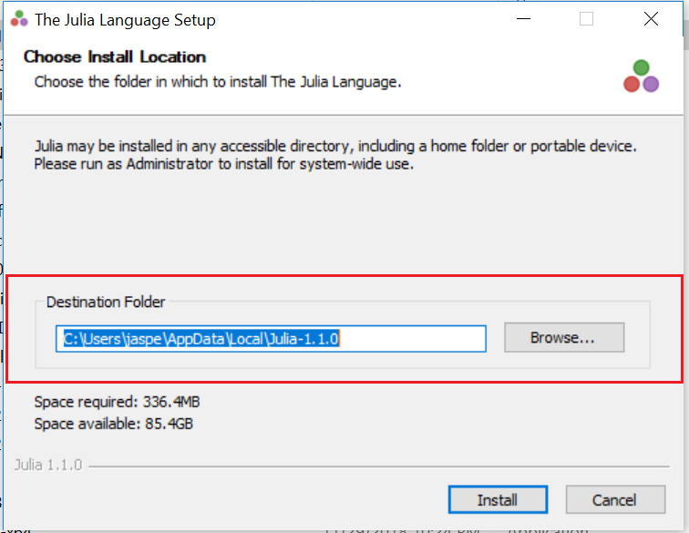
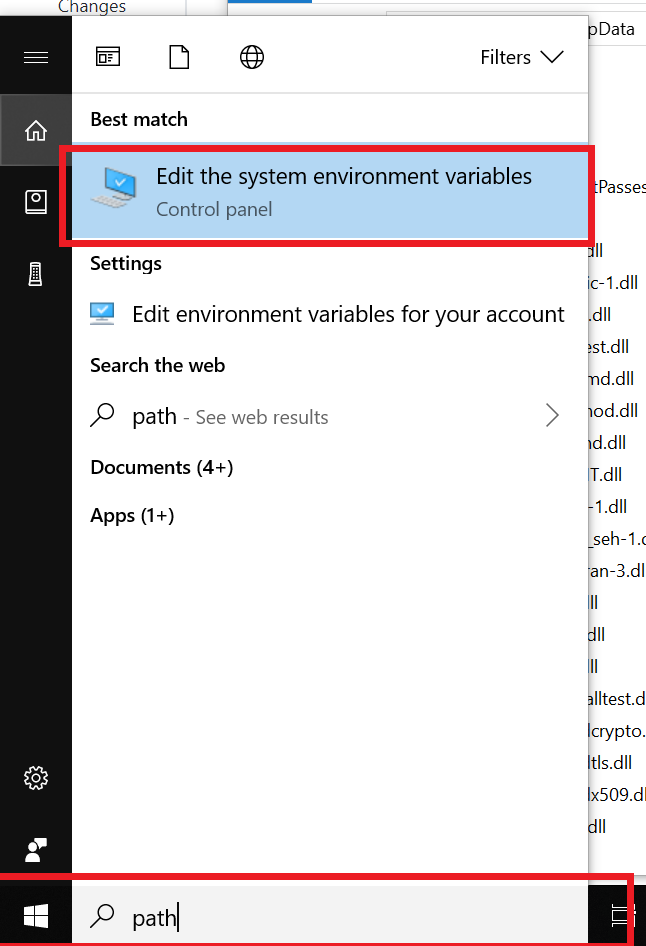
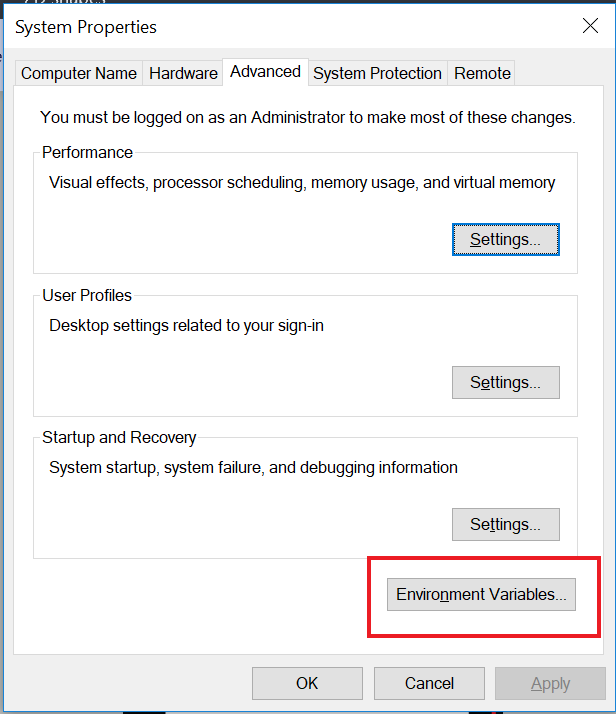
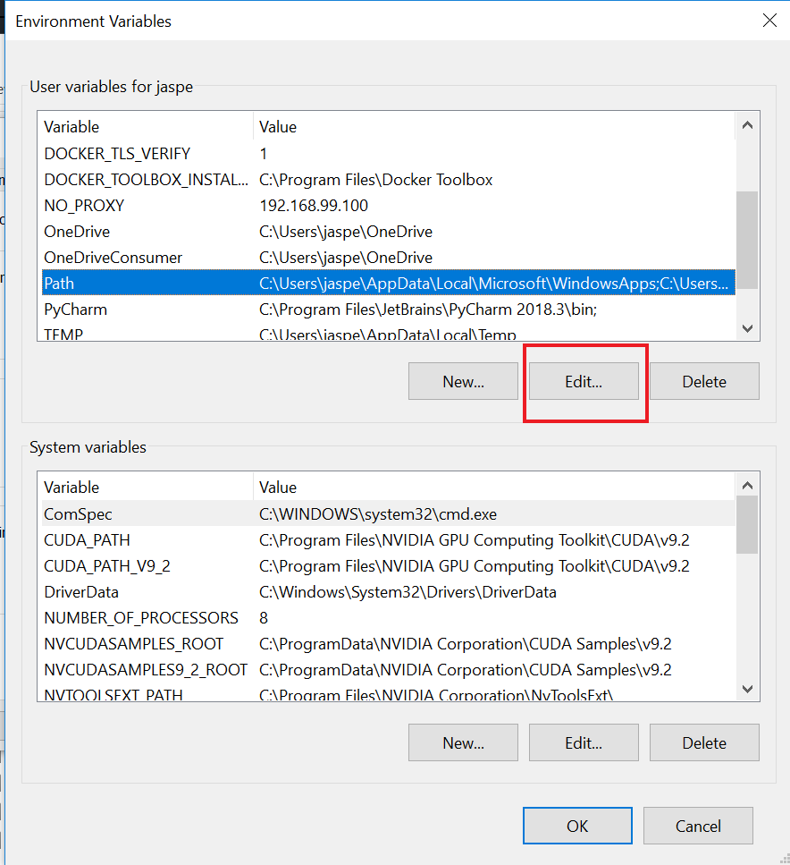
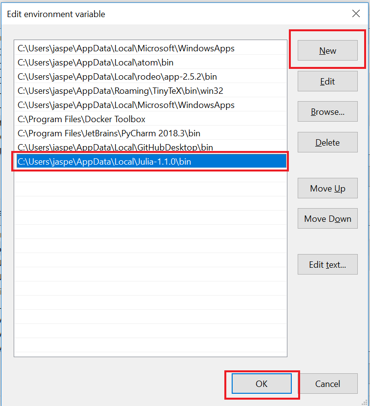

# Bayesian Linear Model (`blm`)

I created this R library to implement some core Bayesian ideas taught in the course "Introduction to Bayesian Statitics" at Utrecht University. Secondly, it also provided me with an opportunity to further practice Julia [LINK]. Julia code is fast, but needs to compile on the first run. Hence, the highly repetitive nature of the code for Bayesian statistics (small functions that are repeatedly used) makes Julia an ideal programming language to run Markov Chain Monte Carlo (MCMC) samplers.

Thanks to the R library JuliaCall [LINK], it is possible to create a near-seamless bridge between R code and Julia code (much like the Reticulate [LINK] library does for Python). This bridge is used as follows:

1. All model-building aspects are constructed in R. Users specify a model much like they would with the `lm()` function. blm imports the magrittr library [LINK] to facilitate model-building, and allows the user to build a model using a 'tidy' workflow. The functions associated with this part of the model begin with `set_` (e.g. `set_priors()`). 
2. After the model is specified by the user, the sampling plan is executed (much like the `collect()` command from the dbplyr library [LINK]). This part calls the Julia code to draw posterior samples. The functions associated with this part of the model end with `_posterior` (e.g. `sample_posterior()`, `update_posterior()`, `delete_posterior()`).
3. Once the posterior distribution is sampled, all plotting functionality and summary statistics of the posterior is executed in R. If additional samples or computations need to be carried out (e.g. posterior predictive checks or DIC), these are executed in Julia. The functions associated with this part start with `evaluate_` (e.g. `evaluate_model_fit()`).

All core functions return S3 objects. Data embedded in these objects can be retrieved using the `get_value()` function (exported to facilitate the tidy workflow).

The following documents contain specific information or implementation notes:

- [Course summary](https://github.com/JasperHG90/blm/blob/master/docs/course_summary.pdf)
- [Implementation notes Gibbs sampler](https://github.com/JasperHG90/blm/blob/master/docs/conditionalposterior.pdf)
- [Implementation notes Metropolis-Hastings sampler](https://github.com/JasperHG90/blm/blob/master/docs/MH.pdf)
- Multilevel analysis of Directors data using JAGS

## Folder structure

The folder structure is described below. Important files are annotated.

    ├── data                                        # Contains data used in the package
    │   └── directors.rda              
    ├── data-raw                                    # R script used to create 'directors.rda'
    │   └── preprocess_directors_data.R  
    ├── docs                                        # Implementation notes, course summary and final assignment
    │   ├── conditionalposteriors.pdf               #  - Implementation notes for Gibbs sampler               
    │   ├── MH.pdf                                  #  - Implementation notes for Metropolis-Hastings sampler
    │   ├── final_assigment.pdf                     #  - Final assignment for the course
    │   ├── course_summary.pdf                      #  - Course summary
    │   ├── multilevel_jags.pdf                     #  - multilevel analysis of the directors dataset using JAGS
    │   └── ...
    ├── experiments                                 # Various files used to test out new features / run simulations
        └── ...
    ├── img                                         # Images used by the README
        └── ...
    ├── inst
        └── julia
            └── blm.jl                              # Julia script containing core blm functions.
    ├── man                                         # Documentation for R functions used by the library
        └── ...
    ├── R
    │   ├── blm_julia_setup.R                       # Logic to build a bridge between R / Julia               
    │   ├── classes.R                               # S3 classes used by blm library          
    │   ├── data.R                                  # Documentation for the 'directors' data
    │   ├── generics.R                              # S3 generics for all methods defined in blm
    │   ├── ggplot_theme.R                          # ggplot2 theme used by blm plotting function
    │   ├── helpers.R                               # utility functions 
    │   ├── input_checks.R                          # helper functions that check whether inputs to key functions are valid
    │   ├── methods_blm.R                           # S3 methods for core class 'blm' 
    │   ├── methods_misc.R                          # S3 methods for minor classes 'R2' and 'DIC'
    │   ├── methods_posterior.R                     # S3 methods for class 'posterior'
    │   ├── methods_ppc.R                           # S3 methods for class 'ppc'
    │   ├── methods_prior.R                         # S3 methods for class 'prior'
    │   ├── methods_sampler.R                       # S3 methods for class 'sampler'
    │   ├── methods_shared.R                        # S3 methods that are shared by classes
    │   └── zzz.R                                   # Contains start-up logic when package is loaded by user
    ├── tests
    │   └── ...                                     # Unit tests
    ├── vignettes
    │   └── ...                                     # Package vignettes
    ├── LICENSE
    ├── .gitignore
    ├── .Rbuildignore
    ├── .travis.yml
    ├── .blm.Rproj
    ├── .DESCRIPTION
    ├── NAMESPACE
    └── README.md

## Installation

Installing the R library from GitHub is straightforward

```r
devtools::install_github("JasperHG90/blm")
```

R dependencies will be installed automatically. You will also need an installation of Julia (>= 1.0.0, in practice either the long-term stable release or the current stable version), which you can install from [here](https://julialang.org/downloads/).

### Aside: installing Julia on Windows

On Windows, follow the following steps.

1. When installing Julia, take note of your installation path



2. Search for 'path' in the windows search path and select 'edit the system environment variables'



3. Click on 'environment variables'



4, Select the 'path' variable under 'user variables for <yourusername>' and click 'edit'



5. Click on 'new' and paste the path you copied at step one, followed by '\bin'. Then click 'OK'.



6. Restart RStudio.

## Setting up R & Julia

To test whether R can find the Julia installation, execute the following in R:

```r
library(blm)
# Create the bridge between R and Julia
blm_setup()
```

If this succeeds, you should see something akin to the following message:

```shell
Julia version 1.0.3 at location /home/jasper/julia-1.0.3/bin will be used.
Loading setup script for JuliaCall...
Finish loading setup script for JuliaCall.
```

This means you are good to go.

## References

The following resources were used.

## Short example

To build a Bayesian Linear Model (blm) object, start by executing the following:

```r
# Load data
data("directors")
# Log the compensation variable ('000 GBR)
directors$Compensation <- log(directors$Compensation)
# Build the model
dirfit <- blm("Compensation ~ Age", data=directors)
```

This creates a blm object for the 'directors' data. At this point, we have a model with uninformative priors (mu=0, sd=1000) and initial values that are drawn from these priors:

```r
print(dirfit)
```

```shell
Bayesian Linear Model (BLM) object:

Data:
	Predictors: 1
	Outcome: Compensation

Sampler:
	Chains: 1
	Iterations: 10000
	Thinning: 1
	Burn: 1000

Priors (Coefficients) :
      b0   b1
mu     0    0
tau 1000 1000

Priors (Residuals) :
      sigma
rate   0.01
scale  0.01
```

Furthermore, the sampling settings are set to just $1$ chain and $10.000$ iterations. We can update the model as follows:

```r
# Set the following values for the dirfit model
dirfit <- dirfit %>%
  # Sampling settings
  set_sampling_options(chains=2, iterations=20000, burn=3000, thinning=2) %>%
  # Set priors for Age (we're on a log scale)
  set_prior("b1", mu=0.2, sd = 0.001) %>%
  # Set initial values
  set_initial_values(chain_1 = list("b" = c(-1, 1), "sigma" = 1),
                     chain_2 = list("b" = c(1, -1), "sigma" = 2))
# Print object
print(dirfit)
```

```shell
Bayesian Linear Model (BLM) object:

Data:
	Predictors: 1
	Outcome: Compensation

Sampler:
	Chains: 2
	Iterations: 20000
	Thinning: 2
	Burn: 3000

Priors (Coefficients) :
      b0    b1
mu     0 0.200
tau 1000 0.001

Priors (Residuals) :
      sigma
rate   0.01
scale  0.01
```

View the full example here [LINK].

## References

I used the following materials in building this library

- All course materials @ Utrecht University Bayesian statistics

    * Gabry, J., Simpson, D., Vehtari, A., Betancourt, M., & Gelman, A. (2019). Visualization in Bayesian workflow. Journal of the Royal Statistical Society: Series A (Statistics in Society), 182(2), 389-402.

    * Schad, D. J., Betancourt, M., & Vasishth, S. (2019). Toward a principled Bayesian workflow in cognitive science. arXiv preprint arXiv:1904.12765.
    
    * Gelman, A., Goodrich, B., Gabry, J., & Vehtari, A. (2018). R-squared for Bayesian regression models. The American Statistician, (just-accepted), 1-6.
    
    * Nakagawa, S., & Schielzeth, H. (2013). A general and simple method for obtaining R2 from generalized linear mixed‐effects models. Methods in Ecology and Evolution, 4(2), 133-142.
    
    * Aarts, E. (2019). Introduction to multilevel analysis and the basic two-level regression model, week 1 notes [powerpoint presentation]. *Introduction to Multilevel Analysis*, Utrecht University.

    * Lynch, S. M. (2007). Introduction to applied Bayesian statistics and estimation for social scientists. Springer Science & Business Media.

    * Gelman, A., Stern, H. S., Carlin, J. B., Dunson, D. B., Vehtari, A., & Rubin, D. B. (2013). Bayesian data analysis. Chapman and Hall/CRC.

    * Kruschke, J. (2014). Doing Bayesian data analysis: A tutorial with R, JAGS, and Stan. Academic Press.
    
    * Hox, J. J., Moerbeek, M., & Van de Schoot, R. (2017). Multilevel analysis: Techniques and applications. Routledge.
    
    * Robert, C. P., Casella, G., & Casella, G. (2010). Introducing monte carlo methods with r (Vol. 18). New York: Springer.
    
    * Hoijtink, H., Mulder, J., Van Lissa, C. J., & Gu, X. (2019). A tutorial on testing hypotheses using the Bayes factor.
    
    * Hoijtink, H., Gu, X., & Mulder, J. (2018). Bayesian evaluation of informative hypotheses for multiple populations. British Journal of Mathematical and Statistical Psychology.
    
    * Gu, X., Mulder, J., & Hoijtink, H. (2018). Approximated adjusted fractional Bayes factors: A general method for testing informative hypotheses. British Journal of Mathematical and Statistical Psychology, 71(2), 229-261.
    
    * Gu, X., Hoijtink, H., & Mulder, J. (2016). Error probabilities in default Bayesian hypothesis testing. Journal of Mathematical Psychology, 72, 130-143.
