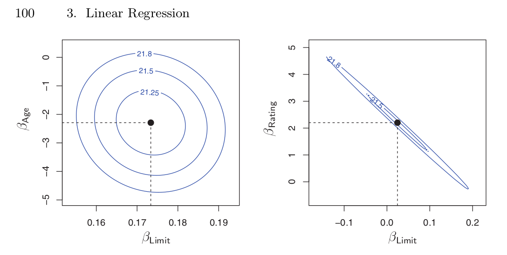

```{r setup, include=FALSE}
knitr::opts_chunk$set(fig.pos="H", fig.width = 3, fig.height = 3, echo = FALSE, 
                      fig.align="center", warning = FALSE, message = FALSE, eval=TRUE)
```

# Introduction (week 1)

A Bayesian statistical analysis consists of several steps.

1. **Research question & data preview**. This is the most important step. We think about *what* it is we want to know and *how* we could represent this using data.
2. **Density of the data**. Here, we construct the likelihood of the data given our problem statement.
3. **Prior distribution for the parameters of the density of the data**. Any likelihood function has parameters. The prior distributions allow us to represent our knowledge of these parameters.
4. **Data collection**.
5. **Posterior distribution**. We construct the posterior distribution using Bayes' rule and sample it repeatedly.
6. **Inference for transformation of the parameters**. Using the samples we drew from the posterior, we can transform the parameters in a lot of ways to obtain new and interesting statistics.
7. **The posterior predictive distribution of the data**. We can use the posterior distribution to repeatedly create predictions, which gives us detailed information about our problem.

## Bayes' rule

Bayesian statistics heavily rely on **Bayes' rule**, which is given by:

$$
\tag{1.1}
f(\theta|x) = \frac{f(x|\theta) f(\theta)}{f(x)}
$$

Where:

- $f(\theta|x)$ is the posterior density.
- $f(x|\theta)$ is the likelihood of the data.
- $f(\theta)$ is the prior distribution of the parameter $\theta$.
- $f(x)$ is a normalizing constant to ensure that the posterior distribution is a 'proper' probability distribution.

## Constructing the density of the data (likelihood)

The density of the data, or *likelihood* of the data, is the **probability/likelihood** of the data *given* the parameter $\theta$. The likelihood of the data depends on the problem under consideration. The likelihood of the data is defined for *every data point*. That is, for one data point, we have

$$
f(x_i | \theta)
$$

By virtue of independence, we can take the product of the individual likelihoods. So, for $n$ data points, we have

$$
f(\vec{x}|\theta) = \prod_{i=1}^n f(x_i | \theta)
$$

## Prior distributions

The parameter $\theta$ is not treated as a fixed but unknown parameter as we would do in frequentist statistics. Rather, we approach it as a random variable. The 'knowledge' that we have about our parameter is summarized in the *prior* $f(\theta)$. In equation $1.1$, we observe that the prior is 'combined' with the likelihood of the data to form the posterior. Hence, we can see that the posterior is a mix between the evidence from observed data and the knowledge we add to the model by means of a prior.

Because of this 'mixing', it would be reasonable to expect that, if we knew a lot about the problem at hand and we could specify this in the prior, the posterior would be heavily affected by this knowledge. Conversely, if we knew nothing about the distribution of our parameters, the posterior would be affected primarily by the evidence we collected in the form of the data.

A prior can be:

1. **Uninformative**. This means that we do not know much about the form of $\theta$, which is reflected in the prior distribution. Suppose that the prior distribution for $\theta$ is a beta distribution $\theta \sim B(\alpha, \beta)$. Then, we could represent our lack of knowledge by using $B(1,1)$, which evaluates to $1$ for every value of $x \in (0,1)$

```{r}
library(ggplot2)
x <- seq(0,1, 0.01)
df <- data.frame(x=x, y=dbeta(x, 1, 1))
ggplot(df, aes(x=x, y=y)) + geom_line(size=2, color="blue") + scale_y_continuous(limits=c(0,2))
```

2. **Informative**. This means that we have some idea about the distribution of $\theta$ prior to the analysis. We can reflect the strength of our *belief* in our knowledge in the way we construct the prior distribution. That is, in our beta distribution above, we can choose different parameters for $\alpha$ and $\beta$ that will change the way the beta distribution looks.

```{r}
library(magrittr)
data.frame(x=x, B27=dbeta(x,2,7), B55=dbeta(x,5,5)) %>%
  tidyr::gather(var, val, -x) %>%
  ggplot(., aes(x=x, y=val, group=var, color=var)) +
    geom_line()
```

In general, high dispersion (variance) indicates more uncertainty about the prior distribution whereas low dispersion indicates more certainty about our prior distribution.

A prior distribution is called *conjugate* if it has the same mathematical form as the density of the data. For example, if we have a binomial likelihood and a beta prior, then we get:

$$
\tag{1.3.1}
\begin{aligned}
f(\theta|x) 
&\propto f(x|\theta)f(\theta) \\
&\propto \left[ \prod_{i=1}^n {n \choose x} \theta^x (1-\theta)^{n-x} \right] \theta^{\alpha-1} (1-\theta)^{\beta-1} \\
&\propto \theta^{\sum x} (1-\theta)^{\sum n-x} \theta^{\alpha-1} (1-\theta)^{\beta-1} \\
&\propto \theta^{(\sum x_i) + \alpha-1} (1-\theta)^{(\sum n-x_i) + \beta-1}
\end{aligned}
$$

The resulting posterior is mathematically similar to the prior.

## Constructing the posterior distribution

After we define the likleihood of the data and the priors, and we have collected our data for analysis, we can construct the posterior probability density $f(\theta|x)$, which is given by

$$
\tag{1.4.1}
f(\theta|x) = f(x|\theta)f(\theta)
$$

Using a sampling procedure, we can then repeatedly sample the posterior distribution. This (hopefully) gives us a good approximation of the posterior.

## Evaluation of the results

To evaluate the results, we compute the *Maximum a Posteriori* (MAP), which is usually the mean of the posterior distribution, but can also be the median or the mode. Furthermore, we calculate the posterior standard deviation of the sampled values and the $95\%$ credible interval. This is analogous to the confidence interval in classical statistics with a much simpler interpretation: the $95\%$ credible interval (CI) has a $95\%$ probability of containing the true value of interest.

## Why Bayesian statistics is called 'subjective'

The use of a prior in Bayesian statistics raises the question *which* prior should be considered best. Ultimately, this is a subjective choice, and a function of

1. (Subjective) prior knowledge.
2. Attitude with respect to the use of prior knowledge on historical data.
3. Evaluation of the 'fit' between study subjects and application in a previous study and current study.
4. Attitude with respect to the use of prior distributions to represent this prior knowledge.

Ultimately, we should reasoned and transparent thinking to select priors of interest.

If we care more about historical results, we could choose to weight historical results more heavily, which results in *power priors*. We weight the likelihood of the historical data by some value $\alpha_0$ to indicate that it should be more or less important than our believe of the distribution of the parameters. **This practice requires domain expertise**.

<MORE ABOUT POWER PRIORS>

## Transformation of posterior densities & posterior predictive distributions

Besides retrieving point estimates, we can also transform posterior distribution as we see fit after we have repeatedly sampled it to compute ratios, differences and other statistics. Such variables are treated as any other, meaning that we similarly calculate metrics like the EAP etc.

Unlike classical statistics, which focuses mainly on the computation of point estimates, bayesian statistics allows us more interesting analysis of posterior predictive results. For example, suppose that we run a linear regression on a dataset which predicts an attitude score from agreeableness and extraversion. Then a posterior predictive distribution of a person with an agreaableness score of $0.5$ and an extraversion score of $2.5$ would be predicted to have an attitude score that lies between $0.8$ and $1.6$ with the mean at an attitude score of $1.16$.

```{r}
library(blm)
blm_setup()
## Exercise 2 data
d <- haven::read_sav("../testing/Exercise 2 - Data.sav")
df <- as.data.frame(d)
# RUn
bfit <- blm("attitude ~ extraversion + agreeableness",
            data=df, center = TRUE) %>%
  # Update sampling settings
  sampling_options(., chains = 2, iterations = 10000, burn = 1000,
                   thinning=2) %>%
  # Sample posterior
  sample_posterior()
# Predict using 200 posterior samples
# Calculate predicted y for these values
agree <- 0.5
extra <- 2.5
X <- matrix(cbind(c(1, extra, agree)), nrow=1)
# w
w <- do.call(rbind.data.frame, bfit$posterior)
w <- w[sample(nrow(w), 200),1:3]
row.names(w) <- 1:nrow(w)
# Compute predicted y
predicted_attitude <- t(X %*% t(w))
hist(predicted_attitude)
```

Hence, posterior predictive distributions help us understand future predictions.

## Practical using R and JAGS

We first need to specify the data in R. This we can do by copying it from the table

```{r, echo=TRUE}
dat <- list(y.PE=58, n.PE=141, y.PC=40, n.PC=143)
```

Next, we specify a JAGS model. Given that we want to test the effectiveness of the treatment $PE$ against $PC$, we will model the success probability $\theta$, which indicates the probability of being cured.

Notice that JAGS doesn't require a specific order of the variables in the model file. This means that you can reference items before assignment.

We also specify an additional variable that we want to collect at each iteration called $RR$ or the relative risk of remaining sick in the PC condition versus the PE condition:

$$
RR = \frac{\theta_{PC}}{\theta_{PE}}
$$

```{r, echo=TRUE, message=FALSE}
# Specify model
mod1 <- 'model{
  
  # Priors (uninformative)
  theta.PE ~ dbeta(1,1)
  theta.PC ~ dbeta(1,1)
  
  # Likelihood of the data
  y.PE ~ dbin(theta.PE, n.PE)
  y.PC ~ dbin(theta.PC, n.PC)
  
  # Contrast (RR)
  RR <- theta.PC / theta.PE
  
}'

# Load rjags
library(rjags)
con <- textConnection(mod1)
# Create a jags model
jmod <- jags.model(file=con, data=dat, n.chains=2)
close(con)
```

At this point, we have initialized the model with uninformative beta priors. Next, we specify the burn-in period and burn $1.000$ samples.

```{r, echo=TRUE}
update(jmod, n.iter = 1000)
```

Finally, we specify the parameters of interest and run the sampler to obtain a sample of the posterior distribution.

```{r, echo=TRUE}
params <- c("theta.PE", "theta.PC", "RR")
res <- coda.samples(jmod, variable.names = params, n.iter=10000)
```

Normally, we would first inspect convergence before viewing the results, but since we have not yet done this we will skip this step. We use the `summary()` function to inspect the results.

```{r, echo=TRUE}
summary(res)
```

We observe the following:

- The probability of recovering under treatment PC is roughly $28\%$, whereas the probability of recovering under treatment PE is roughly $41\%$. 
- The relative risk of $\theta_{PC}/\theta_{PE}$ is $0.68$, $95\%$ CCI = $[0.49, 0.94]$%, meaning that the risk of remaining ill under the treatment PC is $1/0.68 \approx 1.47$ higher than the treatment PE. Since the ratio is below $1$, we can say that we are $95\%$ certain that PE treatment gives a higher chance of recovery than PC treatment.

Notice that, for this model, it is also possible to derive the solution analytically. The mean for the posterior distribution is given by

$$
\hat{\theta_i} = \frac{(\alpha_i + y_i)}{(\alpha_i + y_i) + (\beta_i + n_i - y_i)}
$$

Which gives us

$$
\begin{aligned}
&\theta_{PC} = \frac{1 + 40}{1 + 40 + 1 + 143 - 40} \approx 0.2828 \\
&\theta_{PE} = \frac{1 + 58}{1 + 58 + 1 + 141 - 58} \approx 0.4126
\end{aligned}
$$

The RR then becomes $0.2828/0.4126 \approx 0.6854$. These results are the same as the results we obtained using sampling.

With respect to using informative hypotheses using historical data, I would argue that both datasets fit reasonably well with our current research goal. Under the assumption that the treatments PC and PE are relatively static (don't change much), and that PTSD is a stable condition (which is likely given that the impact of war is horrible in almost any situation), we could use the results from the previous studies by pooling the data together and using these to construct the prior distributions.

In the model file below, we specify the informative distributions.

```{r, echo=TRUE, results="hide"}
mod2 <- 'model{
  
  # Priors (informative)
  theta.PE ~ dbeta(161,191)
  theta.PC ~ dbeta(126,281)
  
  # Likelihood of the data
  y.PE ~ dbin(theta.PE, n.PE)
  y.PC ~ dbin(theta.PC, n.PC)
  
  # Contrast (RR)
  RR <- theta.PC / theta.PE
  
}'

# Load rjags
con <- textConnection(mod2)
# Create a jags model
jmod <- jags.model(file=con, data=dat, n.chains=2)
close(con)
# Run the model
update(jmod, n.iter = 1000)
params <- c("theta.PE", "theta.PC", "RR")
res <- coda.samples(jmod, variable.names = params, n.iter=10000)
```

```{r, echo=TRUE}
summary(res)
```

The posterior mean for RR is $0.68$ with $95\%$ CCI = $[0.58, 0.8]$. The CCIs are smaller and still do not include $1$. Hence, the result of including prior knowledge has quite a big effect.

# Sampling the posterior: Gibbs method (week 2)

Until now, we have seen that:

$$
f(\theta|y) = \frac{f(y|\theta) f(\theta)}{f_\theta(y)}
$$

1. $f(y|\theta)$ is the density of the data (likelihood)
2. $f(\theta)$ is the prior distribution of the parameter $\theta$
3. $f_\theta(y) = \int f(y|\theta)f(\theta)d \theta$ is the marginal distribution
4. $f(\theta|y)$ is the posterior distribution

We also know that the marginal distribution serves the role as a normalizing constant. That is, its role is to ensure that $f(\theta|y)$ is a proper probability distribution. Accordingly, we can state that 

$$
f(\theta|y) \propto f(y|\theta) f(\theta)
$$

In practice, we have three options for sampling from the posterior distribution.

1. If $\theta$ is a single parameter, we can derive the posterior distribution analytically.
2. If $\theta$ is a vector containing multiple parameters, then we could derive conditional posterior distributions and sample the posterior using a Gibbs sampler.
3. If the conditional posteriors derived under $2$ are of an unknown form, we cannot sample directly from them and so we use the Metropolis-Hastings algorithm.

## Two parameter case

Suppose that we have $f(y|\theta_1, \theta_2)$. Then the joint posterior distribution will be:

$$
p(\theta_1, \theta_2 | y) \propto f(y | \theta_1, \theta_2) f(\theta_1, \theta_2)
$$

However, it is more convenient to derive the conditional posterior distributions

\begin{align}
&f(\theta_1|\theta_2, y) \propto f(y | \theta_1, \theta_2) f(\theta_1 | \theta_2) \\
&f(\theta_2|\theta_1, y) \propto f(y | \theta_1, \theta_2) f(\theta_2 | \theta_1)
\end{align}

Note that we often assume that the priors are independent. By definition, if we have independent events $f(\theta_1 | \theta_2)$ and $f(\theta_2 | \theta_1)$ then reduce to $f(\theta_1)$ and $f(\theta_2)$.^[See e.g. [this page](https://newonlinecourses.science.psu.edu/stat414/node/38/)] 

To sample from the posterior distribution, we repeatedly and iteratively sample the conditional posteriors by using the following procedure:

> **Gibbs sampler**
>
>1. Set $h=0$ and $H$ to a large number.
>2. Choose the initial values for $\theta_1, \theta_2 \longrightarrow \theta_1^{(0)}, \theta_2^{(0)}$.
>3. Set $h=h+1$.
>4. Sample $\theta_1^{(h)}$ from the conditional posterior $f(\theta_1|\theta_2^{(h-1)}, y)$.
>5. Sample $\theta_2^{(h)}$ from the conditional posterior $f(\theta_2|\theta_1^{(h-1)}, y)$.
>6. Repeat steps $3-5$ many times until $h=H$.

This procedure is called the *Gibbs sampler*.

## Evaluating convergence

There are several ways to check convergence of the model. Keep in mind that:

- **We should always use a combination of these methods**.
- **We can never prove that a chain has converged**.

1. **Autocorrelation plot**: Because the Gibbs sampler is an MC method, we by definition compute the current value on the basis of the previous one. High autocorrelation means that we are 'stepping through' the posterior space very slowly. This is a problem because we may not observe the entire posterior space. Autocorrelation further occurs because of **(1) mixed distributions** (e.g. a mixed (multimodal) normal distribution) and **(2) high autocorrelation between variables**.

```{r, echo=FALSE, fig.cap="Uncorrelated versus correlated variables. Taken from: James, Gareth et al. Introduction to statistical learning. p.100", out.width="400px"}

```

Autocorrelation disturbs the estimate of the posterior $SD$ and reduces the *effective* sample size (and therefore the information) that we have collected from the posterior. The effective sample size would be the point where the autocorrelation is close to $0$; around about every $40^{th}$ iteration in the plot below.

```{r, echo=FALSE}
x=seq(1,50,1)
cor2=seq(0,1,length.out = length(x))[50:1] + abs(rnorm(50, 0, 0.03))
d <- data.frame(x, cor2)
library(ggplot2)
ggplot(d, aes(x=x, y=cor2)) +
  geom_point()
```


In general, the lower the autocorrelation, the more information we have about the posterior. This is referred to as *mixing*.

2. **Trace/history plots**: We check the values of the parameters against the index over multiple chains to see whether the estimate of the parameter stabilizes over time and to check whether the chains overlap. The value to which the chains coverge is called the **stationary distribution**. It is important that we 'burn' (remove) a set of $n$ (usually close to $1.000$) values from the start of the sequence to give the algorithm time to converge to a stable state.

```{r, echo=FALSE, fig.show='hold', fig.cap="A converged model (left) and a model that has not converged (right) because the two chains do not overlap."}
index <- 1001:10000
converged <- data.frame(
  index = index,
  chain_1 = rnorm(index, 5, 1),
  chain_2 = rnorm(index, 5, 1)
)
library(tidyr)
library(ggplot2)
ggplot(converged %>% gather(chain, value, -index), aes(x=index, y=value, color=chain)) +
  geom_line(alpha=0.4) +
  scale_y_continuous(limits=c(0, 10))

nconverged <- data.frame(
  index = index,
  chain_1 = rnorm(index, 10, 1),
  chain_2 = rnorm(index, 5, 1)
)
ggplot(nconverged %>% gather(chain, value, -index), aes(x=index, y=value, color=chain)) +
  geom_line(alpha=0.4) +
  scale_y_continuous(limits=c(0, 15))

```

3. **Gelman-Rubin Statistic**: The GR statistic assesses convergence of multiple chains. The statistic compares the variance *within* chains to variance *between* chains. Its value should be close to $1$.

4. **MCError**: The MC error is computed as 

$$
\text{MCERR} = \frac{\text{SD}}{\sqrt{\text{iterations}}}
$$

Where the $SD$ value is the standard deviation of the $MAP$ estimates of a parameter. The MC error decreases as the number of iterations $\to \infty$, and should not be larger than $5\%$ of the sample standard deviation.

## What to do if convergence failed?

There are several things we can do if the model fails to converge.

1. Use more iterations
2. Re-parametrize the model, for example by centering the independent variables.
3. Use different priors for correlated variables.
4. Use different initial values.
5. Increase the thinning parameter.

## Practical II using R and JAGS

The goal is to build a regression model that models people's attitude as a function of their agreeableness and extraversion:

$$
\text{attitude}_i = \beta_0 + \beta_1 \text{agreeableness}_i + \beta_2\text{extraversion}_i + e_i
$$

Where $e_i \sim N(0, \sigma^2)$.

We assume the following priors:

- For $\beta_0, \beta_1, \beta_2$ we assume a normal prior. This yields six hyperparameters; a prior mean and variance for each coefficient.
- For $\sigma^2$ we assume an inverse-gamma prior. This yields two hyperparameters; a shape parameter and a scale parameter.

We specify the model as follows. Note the following two things:

1. We are using **uninformative priors**.
2. Since we are using uninformative priors, we draw the coefficients from a normal with mean $\mu_{0,0}$ and variance $\tau^2_{0,0}$. This happens in the line `b[coef] ~ dnorm(0, 1/10000)` below. We **don't see** the part where the likelihood of the data and the prior are merged together into the posterior.
3. In JAGS, we use *precision* instead of *variance*, hence the $1/10000$.

```{r, results="hide", echo=TRUE}
# Load data
d <- haven::read_spss("data/Exercise 2 - Data.sav")

# Make model
linm <- "model{
  
  #### Priors
  
  # Sigma^2
  tau ~ dgamma(0.001, 0.001)

  # Coefficients
  for(coef in 1:3) {
    b[coef] ~ dnorm(0, 1/10000)
  }

  #### Likelihood ==> for each example in the data SEPARATELY

  for(i in 1:length(attitude)) {
    # Calculate the mean value
    mu[i] <- b[1] + b[2] * extraversion[i] + b[3] * agreeableness[i]

    # Use dnorm to calculate the density at the mean value
    attitude[i] ~ dnorm(mu[i], tau)
  }

  #### Variables of interest
  sigma2 <- 1/tau
  sigma <- sqrt(sigma2)

}"

# Specify initial values for the chains
# (this is optional)
init <- list(
  init1 <- list(b = c(7, 0, -5), tau=1),
  init2 <- list(b = c(-5, 0, 7), tau=2)
)

# Text connection
con <- textConnection(linm)

# Jags model
library(rjags)
jmod <- jags.model(file=con, data=d, n.chains=2, inits = init)
close(con)
# Run the model
update(jmod, n.iter = 1000)

# Specify parameter names
params <- c("b", "sigma")
# Run the chain
res <- coda.samples(jmod, variable.names = params, n.iter=10000)
```

We first inspect convergence before we continue on and look at the results of the model.

```{r, fig.show="hold"}
traceplot(res)
```

The traceplot looks converged for each parameter. The values of the different chains largely overlap and are within reasonable bounds (e.g. the variance is small). The parameters seem to have converged to a stationary distribution.

```{r, fig.show="hold"}
densplot(res)
```

Similarly, the density plots show a nice, unimodal normal-like distribution.

```{r}
par(mar=c(1,1,1,1))
autocorr.plot(res)
```

There appears to be some evidence of autocorrelation, especially for the residual error and for the coefficient of agreeableness. The autocorrelation dissappears around the $15^{th}$ lag. To remedy this, we perform grand-mean centering on the variables.

```{r}
par(mar=c(1,1,1,1))
gelman.plot(res)
```

The gelman-rubin plot shows that the between and within variance of the chains are close to one, which is desired. This means that the chains have 'forgotten' their initial states and have converged to the same values.

```{r}
summary(res)
```

From the results, we observe the following:

1. The coefficient for extraversion has a negative sign (and therefore impact) on the outcome attitude with $\beta_2 = -0.082, \ 95\% \text{ CI} = [-.19, .03]$. Because the credible interval contains $0$, we conclude that there is no evidence to support the claim that a person's extraversion score impacts their attitudes towards pets.
2. The coefficient for agreeableness has a positive sign with mean $\beta_3 = 0.26, \ 95\% \text{ CI} = [.082, .444]$. Therefore, for each one-point increase in the agreeableness score, the attitude towards pets increases by a value of $0.26$. Given that the credible interval does not contain $0$, we may conclude that agreeableness positively impacts a person's attitude towards pets.

Next, we run the model with an interaction effect.

```{r, echo=TRUE, results="hide"}
# Load data
d <- haven::read_spss("data/Exercise 2 - Data.sav")

# Make model
linm <- "model{
  
  #### Priors
  
  # Sigma^2
  tau ~ dgamma(0.001, 0.001)

  # Coefficients
  for(coef in 1:4) {
    b[coef] ~ dnorm(0, 1/10000)
  }

  #### Likelihood ==> for each example in the data SEPARATELY
  for(i in 1:length(attitude)) {
    # Calculate the mean value
    mu[i] <- b[1] + b[2] * (extraversion[i] - mean(extraversion)) + 
             b[3] * (agreeableness[i] - mean(agreeableness)) + 
             b[4] * (extraversion[i] - mean(extraversion)) * 
                    (agreeableness[i] - mean(agreeableness))

    # Use dnorm to calculate the density at the mean value
    attitude[i] ~ dnorm(mu[i], tau)
  }

  #### Variables of interest
  sigma2 <- 1/tau
  sigma <- sqrt(sigma2)

}"

# Specify initial values for the chains
# (this is optional)
init <- list(
  init1 <- list(b = c(7, 0, -5, 12), tau=1),
  init2 <- list(b = c(12, -5, 0, 7), tau=2)
)

# Text connection
con <- textConnection(linm)

# Jags model
library(rjags)
jmod <- jags.model(file=con, data=d, n.chains=2, inits = init)
close(con)
# Run the model
update(jmod, n.iter = 1000)

# Specify parameter names
params <- c("b", "sigma")
# Run the chain
res <- coda.samples(jmod, variable.names = params, n.iter=10000)
```

We skip checking convergence for now and go straight to the results.

```{r}
summary(res)
```

From the results, we observe that the $95\%$ CI of the interaction effect contains $0$, and as such we do not have evidence that the effect of agreeableness on liking pets is moderated by extraversion.

# Sampling the posterior: Metropolis-Hastings method (week 4)

The Metropolis-Hastings algorithm is an MC method for sampling the posterior that allows us to sample from a generic probability distribution that we call the 'target distribution', even if we do not know the normalizing constant of the distribution we are looking for. This may occur because e.g. finding the marginal distribution is difficult or impossible because we cannot integrate the function.

To do this, we construct - and sample from - a Markov Chain whose stationary distribution is the distribution that we are looking for. That is:

$$
f(\theta) \propto g(\theta)
$$

The MH algorithm then proceeds as follows:

> **Metropolis-Hastings Algorithm**
>
>1. Select an initial value $\theta^{(0)}$.
>2. For $i=1,\dots, m$, repeat:
>
>     a. draw a candidate value from a proposal distribution $q(\theta)$ s.t. $\theta^* \sim q(\theta^*|\theta^{(i-1)})$.
>     b. Set $\alpha = \frac{g(\theta^*)/ q(\theta^*|\theta^{(i-1)})}{g(\theta^{(i-1)})/ q(\theta^*|\theta^{(i-1)})} = \frac{g(\theta^*) q(\theta^{(i-1)} | \theta^*)}{g(\theta^{(i-1)}) q(\theta^*|\theta^{(i-1)})}$
>     c. If $\alpha \ge 1$: Accept $\theta^*$ and set $\theta^{(i)} \leftarrow \theta^*$
>     d. If $\alpha < 1$: Accept $\theta^*$ and set $\theta^{(i)} \leftarrow \theta^*$ with probability $\alpha$
  
The basic idea of the algorithm is this: if moving is **advantageous** ($\alpha \ge 1$), which you can think of as e.g. being in the tails of the distribution and having a candidate at the peak of the distribution, then *we will always move*. If moving is **not advantageous** ($\alpha < 1$), then we may still move *but only with probability $\alpha$*.

## Selecting a proposal density

The proposal density may or may not depend on the previous value of theta. If it does, then the MH algorithm is called a **random-walk MH algorithm**. If it does not, then we must make sure that $q(\theta) \sim f(\theta)$.

In a random walk MH, the proposal distribution is centered on the value of theta of the previous iteration ($\theta^{(i-1)}$). If we choose $q(\theta)$ to be a symmetric distribution (e.g. a normal), we have a neat additional feature; it means that in step $2b$, we only have to calculate the ratio $\alpha=\frac{g(\theta^*)}{g(\theta^{(i-1)})}$. This works because, for symmetric distributions, $q(\theta^{(i-1)} | \theta^*) = q(\theta^*|\theta^{(i-1)})$.  

The MH algorithm has an **acceptance rate** which is basically the proportion of accepted candidates. High acceptance rates means that we are stepping through the posterior space too slow (slow mixing). Typically, we want an acceptance rate between $20\% \sim 50\%$. Similarly, we want low autocorrelation, but in practice the autocorrelation will be quite high because samples generated from an MH are not i.i.d. (in this case we can always use longer chains).

The Gibbs sampler can be viewed as an MH sampler with a perfect proposal density. Hence, the acceptance rate is $1$ and $q(\theta) = f(\theta)$ exactly.

# Prior/posterior predictive checking (weeks 5-6)

Whenever we run a model, we are confronted with fundamental questions such as how plausible inferences from the model are with respect to the model characteristics of major substantive interest. That is, we are thinking about the following questions:

1. What data would we expect when predicting from the model given the prior or the posterior using prior/posterior predictive distributions?
2. How do these predictive distributions compare to the observed data?

Prior/posterior predictive checking can be used as a flexible method to assess the discrepancy between the model and the data. Using PPC, we can compute posterior predictive p-values, which are interpreted as a measure deviance between the model and the data.

## Test and discrepancy measures

To evaluate the prior/posterior predictive distributions, we compare the observed data $y_{observed}$ to simulated data under the model $y_{simulated}$. The comparison is carried out by using either:

1. **Test statistics**: denoted by $T(y)$, test statistics are a function of the data only. For example, we can compare the mean, variance, mode, minimum, sum etc. of simulated data to the test statistic of the observed data.
2. **Discrepancy measures**: denoted by $D(y, \theta)$, discrepancy measures are a more general form of test statistic that are a function of **both** the data and the parameters. Examples are e.g. a likelihood ratio test.

Whichever measure we use, it is important that the test measure should be chosen *on substantive terms*. Furthermore, we may wonder to what extent the posterior predictive check may vary as a function of plausible values for the priors, which is known as a sensitivity issue / analysis.

## Types of p-values

In the classical framework, we rely on goodness-of-fit tests $T(.)$ for some observed dataset $y_{observed}$

$$
P_C = P\left\{T(y) \ge T(y_{observed} | H_0)\right\}
$$

This is the probability that the test statistic is larger than the observed test statistic *given* the null hypothesis.

Deriving a goodness-of-fit test is difficult for many models because:

1. Some models are simply too complex.
2. Standard goodness-of-fit measures have an https://en.wikipedia.org/wiki/Asymptotic_distribution[asymptotic distribution]() but it lacks accuracy.
3. Sometimes, we would like to measure specific measures of fit rather than a general measure like the likelihood ratio. Deriving such measures is difficult.

Given some prior distribution $f(\theta)$, the prior predictive p-value is given by:

$$
P_{prior} = P\left\{T(y_{simulated}) \ge T(y_{observed}) | f(\theta), H_0\right\}
$$

The posterior predictive p-value is then given by

$$
P_{posterior} = P\left\{T(y_{simulated}) \ge T(y_{observed}) | y_{observed}, H_0\right\}
$$

In both cases, it is the probability that the test statistic of the simulated data exceeds or is equal to the test statistic of the observed data under the model and given some null hypothesis (e.g. 'the model fits the data').

The following is an algorithm for computing prior/posterior predictive p-values for test statistics.

>**PPP for Test Statistics**
>
>1. Choose a test statistic $T(y)$
>2. Calculate $T(y_{observed})$
>3. Repeat for $i=1, \dots, m$:
>
>     a. Draw a vector $\vec{\theta}^{(i)}$ from the posterior distribution $f(\theta|y_{observed}) \propto f(y_{observed}|\theta) f(\theta)$.
>     b. Simulate a dataset $y_{simulated}^{(i)}$ from the likelihood function $P(y|\theta^{(i)})$.
>     c. Calculate $T(y_{simulated}^{(i)})$.
>    
>4. Count the porportion of replicated data sets for which $T(y_{simulated}^{(i)}) \ge T(y_{observed})$.

The following is an algorithm for computing prior/posterior predictive p-values for discrepancy measures. Recall that here, the test function uses both the parameters and the data, and so we must calculate $D(y_{observed}|\theta^{(i)})$ in every iteration of the algorithm:

>**PPP for Discrepancy Measures**
>
>1. Choose a discrepancy measure $D(y, \theta)$
>2. Repeat for $i=1, \dots, m$:
>
>     a. Draw a vector $\vec{\theta}^{(i)}$ from the posterior distribution $f(\theta|y_{observed}) \propto f(y_{observed}|\theta) f(\theta)$.
>     b. Calculate $D(y_{observed}|\theta^{(i)})$.
>     c. Simulate a dataset $y_{simulated}^{(i)}$ from the likelihood function $P(y|\theta^{(i)})$.
>     d. Calculate $D(y_{simulated}^{(i)}, \theta^{(i)})$.
>    
>3. Count the porportion of replicated data sets for which $D(y_{simulated}^{(i)}, \theta^{(i)}) \ge D(y_{observed},\theta^{(i)})$.

## Interpreting the p-value

For the prior predictive p-value, we conclude that the observed data is extreme given our expectations based on the prior model distributions. Hence, the observed data does not fit the prior. **Use if we have informative priors**.

For the posterior predictive p-value, we conclude that the observed data is extreme given the posterior model results. Hence, the observed data does not fit the model and we should try to find another / better fitting model. **Use if we do not have informative priors**.

A p-value is **uniform/ubiased** if, when you sample $y_{observed}$ under a true null model, we have equal odds of obtaining any p-value. 

```{r, fig.cap="A uniform distribution"}
hist(runif(10000, 0, 1))
```

Hence, we say that a significance level of $\alpha=.05$ corresponds to $5\%$ chance of rejecting the null hypothesis when it is true (Type I error). This is **not** the case for posterior predictive p-values, where the tails are smaller. Hence, we want the data to be closer to $0.5$ rather than $.05$.

## Practical: PPC in R and JAGS

The data is the same as we used in week $1$ (treatment PC and PE against post-traumatic stress in war veterans), with the difference being that we now have the entire dataset, not just the totals. We can read it into R as follows:

```{r}
rm(list=ls())
source("data/Exercise 3 - Data.txt")
```

The aim of the current exercise is to check the assumptions of the model. A fundamental assumption we are making is that the success probability $\theta$ is the same across patients in a condition. That is, we assume that, on average, $\theta$ is the same for the last $50$ patients as it is for the first $50$ patients because they are interchangeable in terms of their chance of recovery. This assumption may not hold if there is an unobserved factor that obfuscates the results. For example, patients with intense PTSD may be more likely to sign up to the study, whereas light PTSD patients sign up later, or perhaps the researcher simply improved the therapy halfway through the study.

First, we set up the model file. Instead of a binomial distribution, we now use a bernoulli.

```{r, results="hide", echo=TRUE}
bmod <- "model {
  
  ### Likelihood of the data
  for(i in 1:n.PE) {
    LD.PE[i] ~ dbern(theta.PE)
  }

  for(i in 1:n.PC) {
    LD.PC[i] ~ dbern(theta.PC)
  }

  ### Priors

  theta.PE ~ dbeta(1,1)
  theta.PC ~ dbeta(1,1)

  ### Relative risk

  RR <- theta.PC / theta.PE

}"

# Text connection
con <- textConnection(bmod)

# Jags model
jmod <- jags.model(file=con, data=dat, n.chains=2)
close(con)
# Run the model
update(jmod, n.iter = 1000)

# Specify parameter names
params <- c("theta.PC", "theta.PE", "RR")
# Run the chain
res <- coda.samples(jmod, variable.names = params, n.iter=10000)
```

We check the results against those obtained in exercise $1$

```{r}
summary(res)
```

These results are roughly similar.

We will set up the posterior predictive check as follows:

1. Our null hypothesis $H_0$ is that the model fits the data well.

2. We define a test statistic $T(y)$ as the difference between the proportion of patients cured in the first half of the data against the proportion of patients cured in the second half of the data. Since a proportion cannot really be negative, we take the absolute value.

```{r, echo=TRUE}
# Take the absolute value of the difference
Ty <- function(d) {
  # Split data in half
  h1 <- median(1:length(d))
  # Average proportion
  return( (sum(d[1:h1]) / h1) - (sum(d[(h1+1):length(d)]) / (length(d) - h1)) )
}
# For PE
PE_diff_theta <- abs(Ty(dat$LD.PE))
# For PC
PC_diff_theta <- abs(Ty(dat$LD.PC))
```

3. We will create replicated datasets using the theta values generated from the posterior distribution using the `sim()` function below.

```{r, echo=TRUE}
# Bind posterior values
post_bind <- do.call(rbind.data.frame, res)
# Save theta PE / PC separately
theta_PE <- post_bind$theta.PE
theta_PC <- post_bind$theta.PC

# Convenience function for replications
sim <- function(posterior_theta, N) {
  
  #' @param posterior_theta posterior distribution for a given parameter theta
  #' @param N number of observations in the data
  
  # Open up a vector for results of simulations
  sim_res <- matrix(0L, nrow = length(posterior_theta), ncol = N)
  
  # Simulate new data using the theta values
  for( j in seq_along(1:length(posterior_theta)) ) {
    
    # Generate from a bernoulli a simulated outcome y and store that in the results
    sim_res[j, ] <- LaplacesDemon::rbern(N, posterior_theta[j])
    
  }
  
  # Return
  return(sim_res)
  
}
```

4. We can call the `ppc()` function to compute the posterior predictive check that we also computed on the observed $y$ values.

```{r, echo=TRUE}
# Convenience function for test statistic on simulated data
Ty_sim <- function(posterior_theta, N) {
  
  # Simulate data
  y_sim <- sim(posterior_theta, N)
  
  # Apply row-wise the following function
    # row[i] (N binary values) [==>] Ty(row[i])
    # Return: difference in proportion for first n examples and h-n examples
  return(apply(y_sim, 1, Ty))
  
}

# Simulate y values for PE and PC
y_PE_diff <- abs(Ty_sim(theta_PE, dat$n.PE))
y_PC_diff <- abs(Ty_sim(theta_PC, dat$n.PC))
```

5. The posterior predictive check we will execute is the following: we look at the difference in the test statistic between the simulated and observed data. If the difference is larger than or equal to $0$, we assign a value of $1$. If the difference is less than $0$, we assign a difference of $0$. This is a two-sided test, which means that extreme values are those that either occur close to $0$ **or** close to $1$. 

This makes sense, because the model can misfit in both directions; that is, patients who came earlier may have a higher chance of recovery or patients who came later may have a higher chance of recovery.

```{r, echo=TRUE}
ppc <- function(sim, obs) {
  
  return(ifelse(sim - obs >= 0, 1, 0))
  
}

# For PE
PPC_PE <- ppc(y_PE_diff, PE_diff_theta)
PPC_PC <- ppc(y_PC_diff, PC_diff_theta)
```

6. Finally, we calculate the proportion of cases where the difference in proportion of cured patients between the first half and the second half of the data in the simulated datasets exceeds that of the observed data, or:

$$
P(T(y_{simulated}) \ge T(y_{observed}), H_0) \approx \frac{1}{K} \sum_{i=1}^K T(y_{simulated}^{(i)}) \ge T(y_{observed})
$$

```{r, echo=TRUE}
mean(PPC_PE)
```

```{r, echo=TRUE}
mean(PPC_PC)
```

For the PC treatment, we observe an extreme result under the model. This indicates that we are violating the assumption outlined above. The group in the first half of the treatment has a different chance of recovery than the second half.

# Model selection using DIC (week 7)

With any model, we like to be able to quantify the 'quality' of that model given the problem we are working on. There are many forms of 'information criteria' (IC) such as the AIC, BIC etc. that do this. All IC methods are based on the same principles:

1. We like well-fitting models.
2. We like parsimonious (specific) models that are not complex.

Given that 'well fitting' refers to the fit of the model on the data, it would be reasonable to evaluate the *likelihood* of the data given the parameters, or $f(data|parameters)$. Parsimony is defined by using its antonym 'complexity'. Hence, we have two parts to any IC method:

1. A measure of **fit**. Usually the log-likelihood of the data given the parameters.
2. A measure of **complexity**. Usually a penalty measure involving the number of parameters.

Which sum together as follows:

$$
\text{IC = model misfit + model complexity}
$$

We prefer the model with the smallest IC.

Hence, IC methods give us the ability to compare models that are not nested^[meaning that the models are not of a form s.t. model A fully encompasses model B] and to compare more than two models at the same time. It is a standardized metric, and therefore comparable across models and methods.

## Kullback-Leibler distance

The K-L distance minimizes the distance between the **truth** $p(.)$ and the **model under consideration** $f(.|\theta)$:

$$
\tag{KL}
\text{K-L} = E_{p(y)}\left[\log{p(y)} - \log{f(y|\theta)}\right]
$$

The 'truth' $p(y)$ is a constant and can be ignored when comparing models. Furthermore, since $\log{f(y|\theta)} \ge \log{p(y)}$ we maximize $E \left[\log{f(y|\theta)} \right]$^[In equation KL we are taking a difference. If we drop $\log{p(y)}$ then we are left with $-\log{f(y|\theta)}$. In this case we would *minimize* this value, but since we like to maximize things instead we multiply by $-1$.]. 

To compute $f(y|\theta)$ for a measure like the AIC, we use $\hat{\theta}_y$. This gives us a biased estimate because we are using $y$ both to estimate the model **and** to evaluate the fit. Hence, we need a penalty term to correct for overfitting. 

## Deviance information criterion (DIC)

The DIC minizes the loss function / deviance of a model using the posterior mean:

$$
\text{DIC} = -2 \log{f(y|\bar{\theta_y})} + 2_{PD}
$$

Like all IC measures, the DIC consists of two parts:

1. The **likelihood** of the data, computed as the log of the density of the data using the posterior mean.
2. A measure of **model complexity**, which will be estimated as the effective number of parameters used in the model.

In a complex model or when using informative priors, the number of parameters (dimensionality) is difficult to define. The DIC estimates this number as:

$$
\begin{aligned}
\text{PD} &=  -2\left[E_{p(\theta|y)}\left\{\log{f(y|\theta)}\right\} - \log{f(y|\bar{\theta}_y)}  \right] \\
&\approx -2 \left[\left\{\frac{1}{Q} \sum_{i=1}^Q \log{f(y|\theta^q)}\right\} - \log{f(y|\frac{1}{Q} \sum_{i=1}^Q \theta^q)} \right]
\end{aligned}
$$

When computing the DIC, we prefer the model that has the lower value. Given two models, we then say that model A (lower DIC) provides a better description of the data than model B (higher DIC). 

## Practical: model DIC using R and JAGS

We will use JAGS to obtain the posterior for a logistic regression model. Further, we will make use of the DIC to select a best model.

Recall that for any Generalized Linear Model (GLM) we have the following components:

1. A probability function of the exponential family (Gaussian, Poisson, Binomial etc.). The chosen distribution determines the mean and variance, and whether (how) the variance is related to the mean.
2. A linear predictor $\eta = \beta_0 + \beta_1X_1 + \dots + \beta_jX_j$.
3. A link function that describes how the mean outcome $E(Y) = \mu$ is related to the linear predictor $g(\mu)=\eta$.

Our goal is to make a clinical prediction rule to detect clinical depression in primary care. We use low informative priors. In this case, we therefore use logistic regression. For a binary outcome, the binomial distribution is therefore a logical choice. 

$$
P(Y_i = y_i) = {n_i \choose y_i} \theta^{y_i} (1-\theta)^{1-y_i}
$$

Recall that the mean $\mu$ for the binomial is simply the proportion $\theta$. As such, the link function is a logit, or:

$$
g(\mu) = g(\theta) = \log \left(\frac{\theta}{1-\theta}\right) = \log (\text{odds}) = \text{logit}(\text{odds})
$$

And since the log of the odds equals $g(\mu)$, it therefore follows that:

$$
g(\mu)=\eta \longrightarrow \text{logit}(\mu) = \beta_0 + \beta_1X_1 + \dots + \beta_jX_j
$$

Finally, this means that:

1. The outcome of our model (the coefficients) are given in log-odds. Substantively, only their sign has meaning (i.e. whether the coefficient is positive or negative means that it has a positive or negative effect on the probability of the outcome).
2. Exponentiating a coefficient or multiple coefficients gives us the **odds ratio**. $\text{odds} = \frac{\theta_i}{1-\theta_i} = e^{\beta_0 + \beta_1x_1 + \dots}$.
3. We can also convert the logit to a probability:

$$
\theta_i = \frac{e^{\beta_0 + \beta_1x_1 + \dots}}{1 + e^{\beta_0 + \beta_1x_1 + \dots}}
$$

We first read in the data

```{r}
# Read data
d <- source("data/Exercise 4 - Data.txt")$value
```

Next, we specify the logistic regression model with only `gender` as a predictor

```{r, echo=TRUE, results="hide"}
# depGP is outcome variable
jmodl <- "model {

  ### Likelihood
  for(i in 1:length(depr)) {

    # Outcome variable distributed as bernoulli with theta == p
    depr[i] ~ dbern(p[i])

    # Calculate theta
    # USE []
    logit(p[i]) <- int + b[1]*(gender[i] - mean(gender[]))

  }

  ### Priors

  # Intercept (normal)
  int ~ dnorm(0, 1/1000)
  # Coefficients
  for(j in 1:1) {
    b[j] ~ ddexp(0, sqrt(2)) # OR: b[j] ~ dnorm(0, 1/10000)
  }

  # Variables of interest
  odds_gender <- exp(b[1])
}"

# Parameters
params <- c("int", "b", "odds_gender", "prob_gender")
# Initial values
init <- list(list(int = 0, b=2),
             list(int = 2, b=4))

# Initiate JAGS model
library(rjags)
con <- textConnection(jmodl)
mod_gender <- jags.model(con, data=d, n.chains=2, inits=init)
close(con)

# Burn-in
update(mod_gender, n.iter = 1000)

# Sample posterior
samples <- coda.samples(mod_gender, variable.names=params, n.iter = 10000, thin=2)
```

In the model above, we also calculate the odds ratio for `gender` in the model. The advantage of this is that we do not have to do it outside of the model.

First, we assess convergence

```{r}
traceplot(samples)
```

The trace plot indicates that the coefficients have converged to their stable distribution.

```{r}
gelman.diag(samples)
```

Similarly, we observe that from the gelman-rubin statistic that the two chains have converged as the GR statistic is close to $1$.

```{r}
par(mar=c(1,1,1,1))
gelman.plot(samples)
```

Finally, we check the autocorrelation

```{r}
par(mar=c(1,1,1,1))
autocorr.plot(samples)
```

Autocorrelation is quite an issue in this model. We can reduce it by increasing the thinning parameter and by centering the predictor (even though centering a binary variable is meaningless)

```{r}
summary(samples)
```

The coefficient for gender is positive, which indicates that females have a higher probability of depression than males $\beta_{gender} = 0.432, \  95\% \text{ CCI } = [0.068, 0.822]$. The odds ratio does not include 1, and so we may conclude that gender is a predictor of depression.

Next, we define two other models using different predictors and compare the models using the DIC.

```{r, include=FALSE}
m1 <- "model {
  ### Likelihood
  for(i in 1:length(depr)) {

    # Outcome variable distributed as bernoulli with theta == p
    depr[i] ~ dbern(p[i])

    # Calculate theta
    logit(p[i]) <- int + b[1]*(age[i] - mean(age))

  }

  ### Priors

  # Intercept (normal)
  int ~ dnorm(0, 1/1000)
  # Coefficients
  for(j in 1:1) {
    b[j] ~ ddexp(0, sqrt(2))
  }

  # Variables of interest
  odds_age <- exp(b[1])
}"
# Parameters
params <- c("int", "b", "odds_age")

# Initiate JAGS model
library(rjags)
con <- textConnection(m1)
mod_age <- jags.model(con, data=d, n.chains=2)
close(con)

# Burn-in
update(mod_age, n.iter = 1000)

# Sample posterior
samples_agemod <- coda.samples(mod_age, variable.names=params, n.iter = 10000, thin=2)
```

```{r, results="hide"}
m2 <- "model {
  ### Likelihood
  for(i in 1:length(depr)) {

    # Outcome variable distributed as bernoulli with theta == p
    depr[i] ~ dbern(p[i])

    # Calculate theta
    logit(p[i]) <- int + b[1]*(educ[i] - mean(educ))

  }

  ### Priors

  # Intercept (normal)
  int ~ dnorm(0, 1/1000)
  # Coefficients
  for(j in 1:1) {
    b[j] ~ ddexp(0, sqrt(2))
  }

  # Variables of interest
  odds_educ <- exp(b[1])
}"
# Parameters
params <- c("int", "b", "odds_educ")

# Initiate JAGS model
library(rjags)
con <- textConnection(m2)
mod_educ <- jags.model(con, data=d, n.chains=2)
close(con)

# Burn-in
update(mod_educ, n.iter = 1000)

# Sample posterior
samples_educmod <- coda.samples(mod_educ, variable.names=params, n.iter = 10000, thin=2)
```

```{r, echo=TRUE}
dic_gender <- dic.samples(mod_gender, 1000, "pD")
dic_gender
```

```{r, echo=TRUE}
dic_age <- dic.samples(mod_age, 1000, "pD")
dic_age
```

```{r, echo=TRUE}
dic_educ <- dic.samples(mod_educ, 1000, "pD")
dic_educ
```

Whether or not we use the parameter estimates and DIC depends heavily on our application area. If we were just looking for the best fitting model, we wouldn't necessarily care about insignificant predictors all that much. However, if our goal is inference, we would defnitely want to make more parsimonious models and leave out predictors that don't add much to the model.
